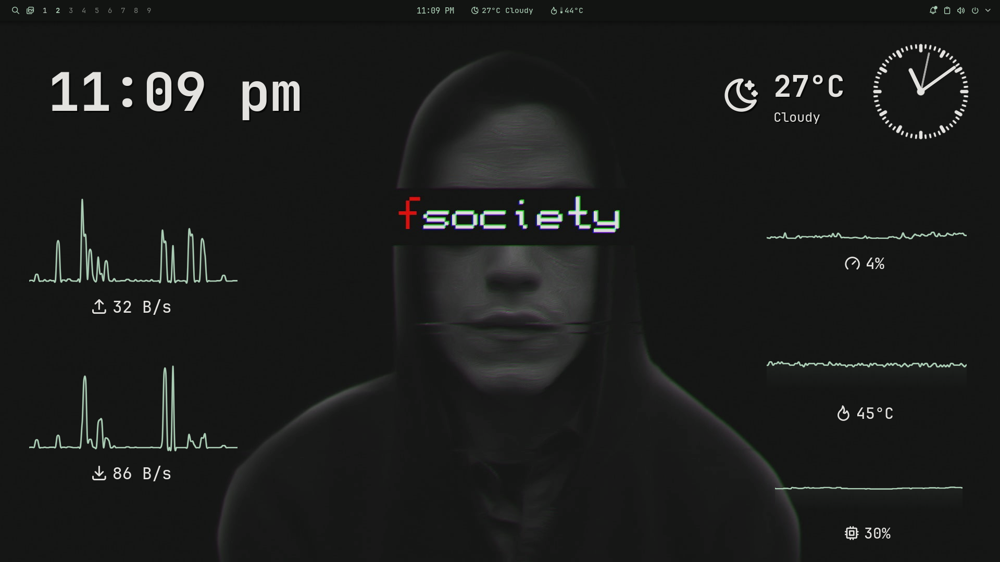

1. config.kdl is my dotfile for niri

2. config.rasi and theme.rasi are my config and theme config files for rofi

3. The wallpaperflare-com-wallpaper-mc.json is my custom color palette

4. config.toml.bak is my noctalia configuration

5. .bashrc is my bash script, used for alias and terminal ricing

               /\
              /  \     I USE ARCH BTW, REMEMBER THY WORDS FOR THE TIME U SHALL LIVE
             /\   \
            /      \
           /   ,,   \
          /   |  |   \-
         /_-''    ''-_\

Alr, i hope anyone who sees this uses arch, sooo jst copy and paste these commands in ur terminal aight
   
    yay -S rofi
   
    yay -S niri
   
    yay -S noctalia

This is how the setup should look like after everything
